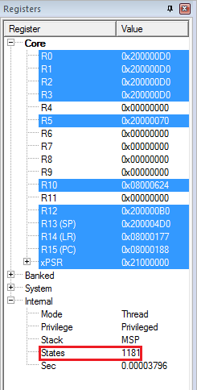

# Задание 3 - Арифметика и битовые операции

# Срок сдачи: 8 ноября 2020 года, 01:00

# Статус: Не сдано

# Оценка: 0


## Задание

### Оговорка

В этом задании вам нужно изменять несколько файлов - main.c, eval.c и bitmagic.c (и отчет) - поэтому не забывайте загружать на гитхаб все три файла!  
И не просто загружать, а заменять существующие (т.е. загружать файлы по правильному пути).

**При упоминании пункта в отчете, пожалуйста, сохраняйте нумерацию пунктов и повторяйте текст пункта целиком.**


В этом задании вам потребуется вставлять в отчет фрагменты дизассемблерного листинга. Для этого можно использовать как простое копирование текста из окна Disassembly (ctrl+c), так и инструмент "Ножницы".

Но лучше все-таки просто текст копировать, потому что это быстрее; к тому же текст гораздо удобнее цитировать в отзыве.

Если у вас не демо-версия Keil'a, то еще можно зайти в `Project -> Options for target -> C/C++` и в поле `Misc.Controls` добавить опции `--asm --interleave`. *Добавить*, не удаляя уже записанные там опции!  
После компиляции проекта в папке `obj` появится файл `main.txt`, содержимое которого будет представлять собой тот же дизассемблерный листинг, что и в окне Disassembly.

## Настоятельные рекомендации

- Пожалуйста, в точности соблюдайте предписанную по заданию структуру файлов, названия функций и их сигнатуры! Это сделано для облегчения автоматического тестирования кода - т.е. для ускорения проверки работ.
- При создании вспомогательных функций, делайте их статическими (`static`).
- Вспомогательные глобальные переменные лучше вообще не создавать, но если очень надо - то тоже делайте их статическими.
- Постарайтесь избавиться от предупреждений компилятора; не игнорируйте их!
- Не забывайте про тесты (красный крестик или зеленая галочка возле коммита); в том числе про предупреждения в них.

## Часть первая - арифметика:

1. В этом проекте есть файл `src/main/eval.c`, в котором находится заготовка функции `eval`: 

    `int32_t eval( const char * formula );`

    Вам необходимо написать ее реализацию. Эта функция принимает на вход строку с формулой, вычисляет ее и возвращает результат. Формула может содержать цифры, знаки `+-*/`, пробелы и круглые скобки. При этом все приоритеты операций будут явно заданы с помощью скобок, т.е. на вход не будет подаваться строк вида `1+3*4`, только строки вида `1+(3*4)`.

    Пробелы во входной строке должны игнорироваться. При вычислениях внутри функции должна использоваться **только** целочисленная арифметика; предполагается, что все числа в формулах целые и при делении дробная часть отбрасывается.

    Использование функций стандартной библиотеки для работы со строками (таких как `strlen`) допускается и приветствуется.

    Примеры:

    ``` cpp
    eval("1+2"); // возвращает 3
    eval("((0*2)-14)"); // возвращает -14
    eval("(100 - (9/1))"); // возвращает 91
    eval("1+(-1)"); // возвращает 0
    ```

    Для входных параметров гарантируется следующее:
    - строка не содержит посторонних символов;
    - строка заканчивается нуль-символом;
    - строка содержит одинаковое количество открывающих и закрывающих круглых скобок;
    - результат вычисления всего выражения помещается в `int32_t`;
    - в процессе вычисления выражения не возникает деления на ноль;
    - унарный минус тоже завернут в скобки.

1. В файле `main.c` подключите заголовочный файл `eval.h`. Вызовите функцию `eval` из `main`'a. Убедитесь, что ваша функция работает правильно (например, написав парочку юнит-тестов).

1. Разберите дизассемблерный листинг этой функции, уделите основное внимание ассемблерным инструкциям, с помощью которых реализованы арифметические действия, битовые операции, сравнения и логические операторы языка С.   
   Вы можете разбирать весь листинг подряд или разбирать только важные фрагменты, как вам удобнее. Однообразные фрагменты можно разобрать один раз.   
   При этом ищите *соответствия* между кодом на С и ассемблером, а не просто "переводите" ассемблер на русский!

1. Смените в функции `eval` тип всех переменных на `int64_t`. Назовите эту функцию `eval_64` (заготовка для нее уже есть в файле `eval.c`): 
   
   `int64_t eval_64( const char * formula );`

   Посмотрите на дизассемблерный листинг функции `eval_64`; разберите основные отличия по сравнению с оригинальной функцией.

1. Смените в функции `eval` тип всех переменных на `float`. Назовите эту функцию `eval_float` (заготовка для нее уже есть в файле `eval.c`): 

    `float eval_float( const char * formula )`

    С помощью счетчика тактов в симуляторе Keil оцените, насколько отличается время выполнения функции `eval` от времени выполнения функции `eval_float` для одинаковых входных строк. 

    Счетчик тактов виден только во время отладки:  
    


    При выполнении этого пункта можно не обращать внимания, на правильность работы `eval_float`.


## Часть вторая - битовые операции

1. В этом проекте есть файл `src/main/bitmagic.c`, в котором лежат заготовки двух функций - `countSetBits` и `countLeadingZeros`. Вам необходимо реализовать эти функции, оставляя их сигнатуры неизменными.
   
   - `uint8_t countSetBits( uint32_t n );`

   Эта функция должна подсчитывать количество равных единице бит входного числа `n` и возвращать его.

   Примеры:

   ``` cpp
   countSetBits(5); // возвращает 2 (в двоичном виде 5 = 101 - два бита равны единице)
   countSetBits(15); // возвращает 4 (в двоичном виде 15 = 1111 - четыре бита равны единице)
   ```

   - `uint8_t countLeadingZeros( uint32_t n );`
   
   Эта функция должна возвращать количество ведущих нулей в двоичном представлении входного числа. Ведущие нули - это старшие нулевые биты.

   Примеры:

   ``` cpp
   countLeadingZeros(5); // возвращает 29 (в двоичном виде uint32_t 5 = 00000000 00000000 00000000 00000101 - 29 нулей до первого (самого старшего) единичного бита)

   countLeadingZeros(0x80000000); // возвращает 0 (в двоичном виде uint32_t 0x80000000 = 10000000 00000000 00000000 00000000 - 31-ый (самый старший) бит равен единице, ведущих нулей нет)
   ```  

  

2. *Пункт на дополнительные 2 балла:* попробуйте минимизировать количество инструкций и строк языка С в функциях `countSetBits` и `countLeadingZeros`. Т.е. попробуйте _поколдовать :)_ В отчете **обязательно** объясните, как работает ваше колдовство.

    

    *Challenge*: самые волшебные реализации не содержат ветвлений и циклов. Вообще.

3.  В файле `main.c` подключите заголовочный файл `bitmagic.h`. Вызовите функции `countSetBits` и `countLeadingZeros`  из `main`'a. Убедитесь, что ваши функции работают правильно (например, написав парочку юнит-тестов).    

4. Разберите дизассемблерный листинг функций `countSetBits` и `countLeadingZeros`, уделите основное внимание ассемблерным инструкциям, с помощью которых реализованы арифметические действия, битовые операции, сравнения и логические операторы языка С.


